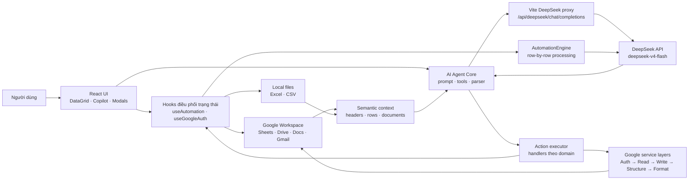

# AutoFlow Studio

<div align="center">


**AI workspace cho Google Sheets, Google Docs, Gmail và dữ liệu Excel/CSV**

Đọc nguồn dữ liệu theo yêu cầu, điều khiển bảng tính bằng ngôn ngữ tự nhiên và chạy quy trình xử lý từng dòng với DeepSeek.

</div>

## Mục lục

- [Tổng quan](#tổng-quan)
- [Tính năng](#tính-năng)
- [Kiến trúc](#kiến-trúc)
- [Cấu trúc mã nguồn](#cấu-trúc-mã-nguồn)
- [Cài đặt nhanh](#cài-đặt-nhanh)
- [Cấu hình môi trường](#cấu-hình-môi-trường)
- [Thiết lập Google OAuth](#thiết-lập-google-oauth)
- [Cách sử dụng](#cách-sử-dụng)
- [Danh mục AI tools](#danh-mục-ai-tools)
- [Giới hạn DeepSeek](#giới-hạn-deepseek)
- [Kiểm thử và build](#kiểm-thử-và-build)
- [Xử lý sự cố](#xử-lý-sự-cố)
- [Nguyên tắc phát triển](#nguyên-tắc-phát-triển)

## Tổng quan

AutoFlow Studio là ứng dụng React/Vite giúp người dùng làm việc với dữ liệu nghiệp vụ trong một workspace thống nhất:

- Chọn Google Sheets và Google Docs trực tiếp từ tài khoản Google đã đăng nhập.
- Tìm kiếm và đọc Gmail theo yêu cầu.
- Tải dữ liệu Excel hoặc CSV từ máy người dùng.
- Xem, sửa, lọc và xử lý dữ liệu trong DataGrid nhiều tab.
- Ra lệnh cho AI Copilot bằng tiếng Việt hoặc tiếng Anh.
- Đồng bộ thao tác ghi trở lại Google Workspace khi người dùng đã cấp quyền.

Ứng dụng không seed dữ liệu mẫu khi khởi động. Dữ liệu chỉ xuất hiện sau khi người dùng chọn nguồn Google Workspace hoặc tải tệp cục bộ. Dữ liệu mẫu chỉ được tạo khi người dùng yêu cầu rõ ràng trong câu lệnh.

## Tính năng

### Workspace dữ liệu

- Google OAuth 2.0 bằng Google Identity Services.
- Google Drive Explorer tìm file theo tên, lọc Sheets/Docs và mở đúng tài khoản đang đăng nhập.
- Đọc Google Sheets theo workbook và từng tab, giữ lại header kể cả khi tab chưa có dòng dữ liệu.
- Đọc Google Docs, trích xuất nội dung văn bản và đưa tài liệu được chọn vào ngữ cảnh AI.
- Tìm, đọc, chọn và nhập email từ Gmail.
- Nhập `.xlsx`, `.xls` và `.csv` bằng parser cục bộ.
- Không tự động liệt kê Drive hoặc đọc tài liệu khi người dùng chưa yêu cầu.

### DataGrid và quản trị Sheet

- Hiển thị nhiều tab trong cùng workbook.
- Chỉnh sửa ô, thêm/xóa dòng, cập nhật header và cột.
- Sắp xếp theo cột, cập nhật vùng A1 và thiết lập công thức.
- Cố định hàng/cột, tự căn chỉnh độ rộng và đặt độ rộng cột.
- Định dạng màu nền, màu chữ, font, cỡ chữ, in đậm/nghiêng và căn lề.
- Tạo hoặc xóa biểu đồ dạng cột, thanh, đường và tròn.
- Xuất dữ liệu hiện tại thành CSV.

### AI Copilot

- DeepSeek tool calling với danh mục 45 action có schema rõ ràng.
- Tự chọn nhóm tool phù hợp với ý định câu hỏi.
- Đọc bổ sung Drive, Docs, Gmail hoặc Sheet trước khi thực hiện action phụ thuộc nguồn.
- Hỗ trợ chuỗi action nhiều bước trong cùng một yêu cầu.
- Hiển thị option dạng nút tương tác khi người dùng yêu cầu chọn phong cách hoặc màu sắc.
- Chuẩn hóa và loại bỏ action trùng lặp trước khi thực thi.
- Bắt buộc xác nhận trước các thao tác phá hủy: xóa tab, xóa dữ liệu hoặc xóa nhiều dòng.
- Hiển thị kết quả từng action trong chat và Terminal Logs.

### Automation Pipeline

- Xử lý từng dòng qua `DeepSeekService.processRow`.
- Trạng thái dòng: `pending`, `running`, `success`, `failed`.
- Điều khiển `start`, `pause`, `resume`, `reset`.
- Tốc độ giao diện: `1x`, `2x`, `4x`.
- Theo dõi tổng số dòng, thành công, lỗi và phần trăm tiến độ.

## Kiến trúc

### Sơ đồ tổng thể



### Luồng AI request

1. `AiCopilotChat` nhận câu lệnh và snapshot trạng thái hiện tại.
2. `buildAgentPrompt` tạo prompt gồm header, dòng dữ liệu, tài liệu được cấp quyền và các boundary rule.
3. `selectWorkspaceTools` chọn nhóm tool theo ngữ nghĩa yêu cầu.
4. `DeepSeekService` gửi request qua proxy Vite với `tool_choice: auto`.
5. `AiAgentService` thực hiện tối đa 3 vòng retrieval để đọc nguồn bổ sung.
6. Tool call và text action được parse, loại trùng và hoàn thiện các action bắt buộc.
7. `executeAgentActions` phân phối action đến handler tương ứng.
8. UI nhận summary, trạng thái thành công/lỗi và cập nhật Google Sheets hoặc state cục bộ.

### Luồng Google Sheets

Các service Google được tách theo trách nhiệm và kế thừa theo chuỗi:

```text
GoogleAuthService
  └─ GoogleReadService
      └─ GoogleWriteService
          └─ GoogleStructureService
              └─ GoogleFormattingService
                  └─ GoogleSyncService
```

- `GoogleAuthService`: OAuth session, token và email tài khoản.
- `GoogleReadService`: metadata, header và dữ liệu tab.
- `GoogleWriteService`: cập nhật ô, header, dòng và xóa dữ liệu.
- `GoogleStructureService`: tạo/xóa/đổi tên/nhân bản tab, freeze, sort và range.
- `GoogleFormattingService`: màu sắc, font, kích thước cột và biểu đồ.
- `GoogleSyncService`: facade được UI và hook sử dụng.

### Nguyên tắc phân lớp

- Component chỉ phụ trách hiển thị và sự kiện người dùng.
- Hook điều phối state, loading, log và callback từ UI.
- AI core không gọi trực tiếp component; action được chuyển qua context của executor.
- Handler tách theo domain: Sheet, row, pipeline, Gmail, Drive và Docs.
- Google service không chứa logic giao diện.
- Lỗi được chuyển thành thông báo nghiệp vụ qua `getUserErrorMessage`; không dùng `catch` rỗng mơ hồ cho luồng cần báo lỗi.

## Cấu trúc mã nguồn

```text
.
├── src/
│   ├── App.tsx                         # Root layout và kết nối các feature
│   ├── main.tsx                        # React entry point + Error Boundary
│   ├── components/
│   │   ├── chat/                       # AI Copilot và dialog xác nhận
│   │   ├── error/                      # AppErrorBoundary
│   │   ├── layout/                     # Header, auth, theme, controls
│   │   ├── pipeline/                   # DataGrid, pipeline, logs
│   │   ├── ui/                         # UI primitives và animation
│   │   └── workspace/                  # Drive, Gmail, Docs modal
│   ├── core/
│   │   ├── ai/
│   │   │   ├── handlers/               # Thực thi action theo domain
│   │   │   ├── tools/                  # JSON schema cho 45 tool
│   │   │   ├── buildAgentPrompt.ts     # Prompt + semantic context
│   │   │   ├── executeAgentActions.ts  # Dispatcher và execution report
│   │   │   ├── agentActionParser.ts    # Parse tool call/text action
│   │   │   └── workspaceCommandCatalog.ts
│   │   ├── engine/                    # AutomationEngine
│   │   ├── google/                    # OAuth, REST services và types
│   │   ├── logging/                   # Log entry factory
│   │   ├── parsers/                   # Excel/CSV và public Sheet reader
│   │   ├── services/                  # DeepSeek, AI agent, Google facade
│   │   ├── undo/                      # Kiểu và inverse action
│   │   └── utils/                     # Error và text utilities
│   ├── hooks/                         # State orchestration của React
│   ├── types/                         # DataRow, pipeline và app contracts
│   └── utils/                         # Tiện ích UI dùng chung
├── scripts/                           # Contract, unit và API checks
├── index.html
├── vite.config.ts                     # Alias + DeepSeek dev/preview proxy
├── tailwind.config.js
├── tsconfig.json
└── package.json
```

## Cài đặt nhanh

### Yêu cầu

- Node.js 18 trở lên; Node.js 20 LTS được khuyến nghị.
- npm 9 trở lên.
- Google Cloud project nếu muốn dùng Google Workspace.
- DeepSeek API key nếu muốn dùng AI Copilot hoặc Automation Pipeline.

### Chạy local

```bash
git clone https://github.com/NguyenHoangPhuong275/autoflow.git
cd autoflow
npm ci
cp .env.example .env
npm run dev
```

Trên PowerShell:

```powershell
Copy-Item .env.example .env
npm run dev
```

Mở [http://localhost:5173](http://localhost:5173).

## Cấu hình môi trường

`.env.example`:

```env
# OAuth Client ID loại Web của Google Cloud
VITE_GOOGLE_CLIENT_ID=

# Key dùng bởi DeepSeek proxy phía Vite/dev server
DEEPSEEK_API_KEY=
```

Biến tùy chọn:

```env
# Chỉ bật khi cần xem diagnostics trong môi trường development
VITE_DEBUG_ERRORS=false
```

Lưu ý:

- Không commit `.env`; file này đã nằm trong `.gitignore`.
- Ưu tiên `DEEPSEEK_API_KEY` để key không bị đưa vào bundle trình duyệt.
- `VITE_DEEPSEEK_API_KEY` vẫn được code hỗ trợ cho môi trường đặc biệt, nhưng mọi biến `VITE_*` có thể bị expose phía client.
- DeepSeek được gọi qua endpoint nội bộ `/api/deepseek/chat/completions`.
- `vite.config.ts` cung cấp proxy cho dev và preview. Khi triển khai production bằng static hosting, cần có backend/serverless proxy tương đương và không đưa secret vào client.

## Thiết lập Google OAuth

1. Mở [Google Cloud Console](https://console.cloud.google.com/).
2. Tạo hoặc chọn một project.
3. Enable các API cần dùng:
   - Google Sheets API
   - Google Drive API
   - Google Docs API
   - Gmail API
4. Cấu hình OAuth consent screen và thêm tài khoản test nếu app đang ở chế độ Testing.
5. Tạo OAuth Client ID loại **Web application**.
6. Thêm Authorized JavaScript origin:
   - `http://localhost:5173`
7. Ghi Client ID vào `VITE_GOOGLE_CLIENT_ID` trong `.env`.
8. Chạy app và bấm **Đăng nhập Google**.

Ứng dụng yêu cầu các scope chính cho Sheets, Drive, Docs, Gmail và email tài khoản. Chỉ cấp quyền cho tài khoản/workspace phù hợp với dữ liệu cần xử lý.

## Cách sử dụng

### 1. Nạp nguồn dữ liệu

- **Google Drive**: đăng nhập Google, chọn `Chọn từ Drive`, tìm đúng file theo tên rồi chọn Sheets hoặc Docs.
- **Google Docs**: mở `Chọn Docs`, tìm tài liệu theo tên, đọc và nhập nội dung khi cần.
- **Gmail**: mở `Gmail`, lọc theo truy vấn hoặc preset, chọn email rồi nhập vào Sheet hiện tại.
- **Excel/CSV**: chọn `Tải Excel/CSV` để đọc file cục bộ.

Không cần nhập URL thủ công trong UI. Việc tìm và nạp file được thực hiện từ tài khoản Google đã đăng nhập hoặc từ file người dùng chọn.

### 2. Làm việc với DataGrid

Chọn tab cần thao tác, chỉnh sửa ô trực tiếp hoặc dùng AI Copilot. Header và dữ liệu của các tab được lập chỉ mục để AI hiểu đúng cấu trúc trước khi tạo action.

### 3. Ra lệnh cho AI Copilot

Ví dụ:

```text
Tìm Google Sheet tên "Test Case Tuần 6" trong Drive của tôi và đọc tab đó.

Đọc Docs "Tuần 6", sau đó tạo các test case tương ứng vào tab "Test Case Tuần 6" theo các cột đang có.

Tạo một tab "SUB Test Case" trong workbook hiện tại, dùng cùng header và lấy một dòng dữ liệu mẫu từ sheet nguồn.

Định dạng hàng header của tab "Test Case Tuần 6" màu xanh đậm, chữ trắng và tự căn chỉnh độ rộng cột.

Gửi email báo cáo kết quả xử lý cho team@example.com.
```

AI sẽ trả về action summary trong chat. Các action xóa dữ liệu hoặc xóa tab phải được xác nhận trong giao diện trước khi chạy.

### 4. Chạy Pipeline

1. Nạp dữ liệu vào DataGrid.
2. Chọn tốc độ xử lý.
3. Bấm **Start**.
4. Theo dõi trạng thái từng dòng và Terminal Logs.
5. Dùng **Pause**, **Resume** hoặc **Reset** khi cần.

Mỗi dòng được gửi đến `DeepSeekService.processRow` để tạo trạng thái xử lý ngắn gọn. Không nên chạy Pipeline trên dữ liệu nhạy cảm nếu chưa được phép chia sẻ với dịch vụ AI.

## Danh mục AI tools

Agent hiện có **45 tools**, được chia theo domain:

| Domain | Số lượng | Tools |
| --- | ---: | --- |
| Sheet | 19 | `create_spreadsheet`, `create_sheet`, `delete_sheet`, `duplicate_sheet`, `rename_sheet`, `switch_sheet`, `clear_sheet`, `update_headers`, `add_column`, `delete_column`, `freeze_rows_cols`, `sort_range`, `update_range`, `set_formula`, `format_cells`, `auto_resize_columns`, `set_column_width`, `add_chart`, `clear_charts` |
| Row | 6 | `update_row`, `batch_update_rows`, `add_row`, `batch_add_rows`, `delete_row`, `batch_delete_rows` |
| Pipeline | 8 | `start_pipeline`, `pause_pipeline`, `resume_pipeline`, `reset_pipeline`, `change_speed`, `clear_logs`, `export_csv`, `load_url` |
| Gmail | 5 | `search_emails`, `read_email`, `send_email`, `trash_email`, `delete_email` |
| Drive | 4 | `search_drive`, `create_drive_folder`, `rename_drive_file`, `delete_drive_file` |
| Docs | 3 | `read_google_doc`, `create_google_doc`, `append_google_doc` |

`load_url` là action nội bộ cho luồng nạp Sheet sau khi hệ thống đã xác định được file; nó không tạo lại ô nhập URL trong giao diện người dùng.

## Giới hạn DeepSeek

Các giới hạn hiện được tập trung tại `src/core/services/deepSeekLimits.ts`:

| Hạng mục | Giới hạn ứng dụng |
| --- | ---: |
| Input context budget | 1.000.000 token |
| Output budget tối đa | 384.000 token |
| HTTP request body | 32 MB |
| Retrieval/message truncation | Theo input token budget |

Ứng dụng dùng heuristic `1 ký tự ≈ 1 token` để chặn request an toàn. Đây là ngân sách bảo vệ ở tầng ứng dụng, không thay thế giới hạn và chính sách billing thực tế của DeepSeek.

## Kiểm thử và build

```bash
# Kiểm tra TypeScript
npm run typecheck

# Chạy toàn bộ contract test và unit test
npm test

# Build production
npm run build

# Chạy build bằng Vite preview
npm run preview

# Kiểm tra trực tiếp DeepSeek API key và model
npm run check:deepseek
```

Các nhóm test hiện có:

- Contract snapshot cho DeepSeek, tool catalog, Google service chain, hooks và Error Boundary.
- Semantic-context test cho Drive/Docs/Sheet retrieval và action population.
- Unit test cho email format, formula utilities, undo engine và Google service contracts.

## Xử lý sự cố

### Không đăng nhập được Google

- Kiểm tra `VITE_GOOGLE_CLIENT_ID`.
- Kiểm tra origin `http://localhost:5173` trong OAuth Client.
- Kiểm tra các API và OAuth consent screen đã được bật.
- Nếu app ở chế độ Testing, thêm tài khoản Google vào Test users.

### DeepSeek trả về 503 hoặc thiếu API key

- Đặt `DEEPSEEK_API_KEY` trong `.env`.
- Khởi động lại `npm run dev` sau khi đổi `.env`.
- Chạy `npm run check:deepseek` để kiểm tra key và model.

### Sheet không có dữ liệu

- Kiểm tra đã đăng nhập đúng tài khoản Google.
- Chọn file từ Drive thay vì mở một tab rỗng.
- Kiểm tra quyền truy cập file và header hàng đầu tiên.
- Ứng dụng không tự thêm dữ liệu mẫu nếu câu lệnh không yêu cầu.

### Action không chạy đúng tab

Nêu rõ tên tab trong câu lệnh, ví dụ: `trên tab Test Case Tuần 6`. Agent sẽ truyền `sheetTitle` cho action phụ thuộc tab đó và nạp cấu trúc Sheet khi cần.

### Giao diện gặp lỗi runtime

`AppErrorBoundary` hiển thị màn hình khôi phục, cho phép reload/reset và sao chép error report. Chỉ bật `VITE_DEBUG_ERRORS=true` trong development khi cần diagnostics kỹ thuật.

## Nguyên tắc phát triển

- Không commit credential, token hoặc dữ liệu Google thật.
- Không đưa dữ liệu mẫu hard-code vào production flow.
- Giữ action schema, prompt, parser và handler nhất quán khi thêm capability mới.
- Mọi action ghi/xóa phải có đường đi lỗi rõ ràng và summary để UI hiển thị.
- Cập nhật README khi thay đổi tool, env variable, API flow hoặc cấu trúc thư mục.
- Trước khi tạo commit, chạy tối thiểu:

```bash
npm run typecheck
npm test
npm run build
```

## Tài liệu liên quan

- [IMPLEMENTATION_PLAN.md](IMPLEMENTATION_PLAN.md): kế hoạch và acceptance criteria nội bộ.
- [spreadsheet_full_permissions_actions.md](spreadsheet_full_permissions_actions.md): ghi chú về nhóm thao tác Google Sheets.
- [DeepSeek API documentation](https://api-docs.deepseek.com/): tài liệu API chính thức.

## License

Repository hiện chưa công bố license mã nguồn mở. Vui lòng xác nhận chính sách sử dụng trước khi phân phối hoặc triển khai lại bên ngoài phạm vi dự án.
