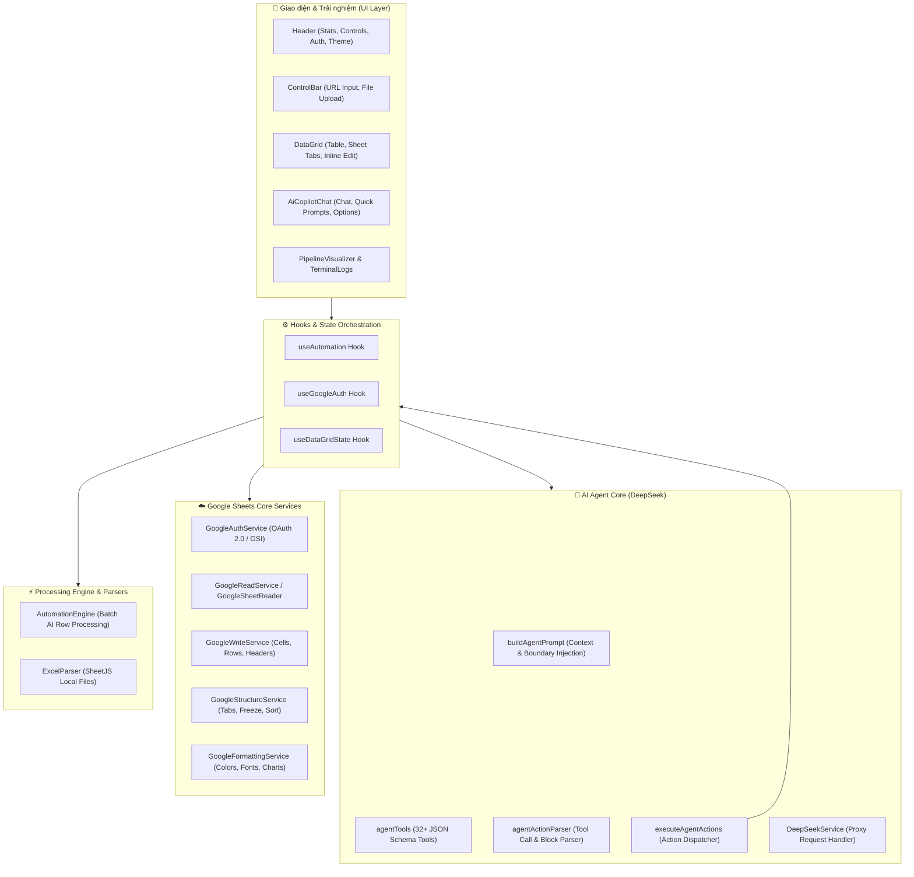

# ⚡ AutoFlow Studio (Pro v2.5)

<div align="center">


<p align="center">
  <b>Hệ thống Quản trị Bảng tính Thông minh & Tự động hóa Dữ liệu đa tầng được hỗ trợ bởi DeepSeek AI Agent</b>
</p>

[Tính năng](#-tính-năng-nổi-bật) • [Kiến trúc](#-sơ-đồ-kiến-trúc) • [Danh mục 32+ Tool](#-danh-mục-công-cụ-ai-agent-tools) • [Cài đặt & Cấu hình](#-hướng-dẫn-cài-đặt) • [Lệnh mẫu](#-ví-dụ-câu-lệnh-mẫu) • [Lộ trình](#-lộ-trình-phát-triển)

---

</div>

## 📖 Giới thiệu (Overview)

**AutoFlow Studio** là giải pháp toàn diện kết hợp giữa giao diện bảng tính trực quan (**DataGrid**) và trợ lý trí tuệ nhân tạo **AI Copilot (DeepSeek-V3 / DeepSeek-Chat)**. 

Ứng dụng cho phép bạn kết nối trực tiếp với Google Sheets qua OAuth 2.0 hoặc làm việc với các tệp Excel/CSV cục bộ, cung cấp khả năng:
- Điều khiển, chỉnh sửa cấu trúc, định dạng và biểu đồ bảng tính hoàn toàn bằng ngôn ngữ tự nhiên tiếng Việt.
- Xử lý pipeline tự động hóa hàng loạt dữ liệu theo thời gian thực.
- Đồng bộ 2 chiều tức thì giữa trình duyệt và Google Cloud Sheets.

---

## ✨ Tính năng nổi bật (Key Features)

### 🤖 1. AI Copilot Agent (DeepSeek Function Calling)
- Tích hợp hơn **32+ Function Calling Tools** chuyên biệt cho thao tác bảng tính.
- Tự động nhận diện ngữ cảnh workbook hiện tại (danh sách tab, tên cột, dữ liệu các hàng đang mở).
- Hỗ trợ thực thi chuỗi hành động liên hoàn (*Multi-action batching*) chỉ trong 1 câu lệnh.
- Cung cấp các nút tùy chọn tương tác trực quan (**Options Preview Buttons**) khi người dùng yêu cầu phối màu hoặc định dạng font chữ.

### 📊 2. Quản trị & Đồng bộ Google Sheets 2 Chiều
- **OAuth 2.0 (Google Identity Services)**: Đăng nhập an toàn, cấp quyền ghi trực tiếp lên tài khoản Google của bạn.
- **Google Sheets API v4**: Hỗ trợ đầy đủ các thao tác đọc/ghi ô, thêm/xóa hàng, tạo/nhân bản/xóa tab, cố định dòng (freeze), sắp xếp (sort), đổi màu cell, căn lề và co giãn độ rộng cột.
- **Public Reader Fallback**: Tự động chuyển sang chế độ đọc công khai qua Google Visualization API khi chưa đăng nhập.

### ⚡ 3. Engine Tự động hóa Dữ liệu (Automation Pipeline)
- Xử lý tuần tự từng dòng dữ liệu bằng AI với tốc độ tùy chỉnh (1x, 2x, 4x tương ứng 1000ms, 500ms, 200ms).
- Khả năng Tạm dừng (*Pause*), Tiếp tục (*Resume*), Đặt lại (*Reset*) và theo dõi tiến độ thời gian thực.
- Hiệu ứng trực quan hóa luồng dữ liệu **Animated Beam Pipeline Visualizer**.

### 🖥️ 4. DataGrid & Giao diện Hiện đại
- Hỗ trợ xem đa tab, tìm kiếm nhanh, lọc theo trạng thái dòng (*Chờ xử lý, Đang chạy, Hoàn thành, Có lỗi*).
- Chỉnh sửa trực tiếp trên từng ô (*Inline Cell Editing*), thêm dòng nhanh và xuất file CSV tức thì.
- Terminal Logs trực tiếp ghi lại mọi sự kiện với các cấp độ (*Info, Process, Success, Warn, Error*).
- Hỗ trợ chuyển đổi giao diện **Dark Mode / Light Mode** mượt mà.

---

## 🏗️ Sơ đồ Kiến trúc (Architecture)



---

## 🛠️ Danh mục Công cụ AI Agent (Tools Matrix)

Trợ lý **AutoFlow Agent** được trang bị 32 công cụ chuyên biệt chia làm các nhóm chức năng:

| Nhóm | Tên Tool | Mô tả chức năng |
| :--- | :--- | :--- |
| **Quản lý Sheet/Tab** | `create_sheet` | Tạo trang tính mới kèm danh sách cột khởi tạo |
| | `delete_sheet` | Xóa vĩnh viễn một trang tính khỏi workbook |
| | `duplicate_sheet` | Nhân bản (clone) trang tính đã có |
| | `rename_sheet` | Đổi tên trang tính |
| | `switch_sheet` | Chuyển tab đang xem trên màn hình |
| | `clear_sheet` | Xóa sạch toàn bộ dữ liệu hàng (giữ lại header) |
| **Cấu trúc Cột & Bảng** | `update_headers` | Đổi tên toàn bộ cột theo chuẩn (camelCase, hoa, thường) |
| | `add_column` | Thêm một cột mới vào bảng tính |
| | `delete_column` | Xóa một cột khỏi bảng tính |
| | `freeze_rows_cols` | Cố định hàng/cột tiêu đề |
| | `sort_range` | Sắp xếp dữ liệu theo cột tăng dần hoặc giảm dần |
| **Định dạng & Thẩm mỹ** | `format_cells` | Chỉnh màu nền, màu chữ, in đậm, font chữ, căn lề |
| | `set_column_width` | Thiết lập chiều rộng cột theo pixel (ví dụ 160px) |
| | `auto_resize_columns` | Tự động căn chỉnh độ rộng cột để không bị che chữ |
| **Biểu đồ & Thống kê** | `add_chart` | Tạo biểu đồ Cột, Thanh, Đường, Tròn từ dữ liệu |
| | `clear_charts` | Xóa toàn bộ biểu đồ cũ trên trang tính |
| **Thao tác Dữ liệu** | `update_row` | Cập nhật giá trị ô của 1 dòng theo ID hoặc số thứ tự |
| | `batch_update_rows` | Cập nhật hàng loạt nhiều ô/dòng cùng lúc |
| | `add_row` | Thêm 1 dòng mới vào bảng tính |
| | `batch_add_rows` | Thêm nhiều dòng mới cùng lúc |
| | `delete_row` | Xóa 1 dòng theo ID hoặc số thứ tự |
| | `batch_delete_rows` | Xóa nhiều dòng cùng một lúc theo danh sách ID |
| | `update_range` | Cập nhật dải ô A1 với ma trận giá trị 2D |
| | `set_formula` | Gán công thức tính toán (=SUM, =C2*D2, ...) |
| **Hệ thống & Pipeline** | `start_pipeline` | Bắt đầu chạy quy trình tự động hóa AI |
| | `pause_pipeline` | Tạm dừng quy trình đang chạy |
| | `resume_pipeline` | Tiếp tục quy trình đang dừng |
| | `reset_pipeline` | Đặt lại trạng thái dữ liệu về ban đầu |
| | `change_speed` | Thay đổi tốc độ xử lý (200ms, 500ms, 1000ms) |
| | `clear_logs` | Dọn sạch nhật ký Terminal |
| | `export_csv` | Xuất dữ liệu bảng hiện tại ra tệp CSV |
| | `load_url` | Nạp liên kết Google Sheet mới vào hệ thống |

---

## 🚀 Hướng dẫn Cài đặt (Getting Started)

### 1. Yêu cầu môi trường
- **Node.js**: Phiên bản `>= 18.0.0`
- **NPM** hoặc **Yarn / PNPM**

### 2. Cài đặt mã nguồn

```bash
# 1. Clone hoặc mở thư mục dự án
cd "d:/Tool Lỏ"

# 2. Cài đặt các thư viện phụ thuộc
npm install
```

### 3. Cấu hình biến môi trường (`.env`)

Sao chép file `.env.example` thành `.env` và điền các thông tin xác thực:

```bash
cp .env.example .env
```

Nội dung file `.env`:

```env
# Google OAuth 2.0 Client ID (dùng cho đăng nhập và ghi Google Sheets)
VITE_GOOGLE_CLIENT_ID="YOUR_GOOGLE_CLIENT_ID.apps.googleusercontent.com"

# DeepSeek API Key (dùng cho AI Copilot Agent & Pipeline Engine)
DEEPSEEK_API_KEY="sk-xxxxxxxxxxxxxxxxxxxxxxxxxxxxxxxx"
```

> 💡 **Mẹo thiết lập Google Client ID**:
> 1. Truy cập [Google Cloud Console](https://console.cloud.google.com/).
> 2. Bật **Google Sheets API**.
> 3. Tạo **OAuth 2.0 Client ID (Web Application)** với Authorized JavaScript Origins: `http://localhost:5173`.

### 4. Kiểm tra kết nối DeepSeek API

```bash
npm run check:deepseek
```

### 5. Khởi chạy ứng dụng

```bash
npm run dev
```

Truy cập trình duyệt tại địa chỉ: `http://localhost:5173`

---

## 💬 Ví dụ Câu lệnh Mẫu (Example Prompts)

Dưới đây là một số câu lệnh thực tế bạn có thể gõ trực tiếp vào AI Copilot:

### 1. Tạo & Quản lý cấu trúc Sheet
```text
"Tạo cho tôi một sheet mới tên là Vouchers với các cột: code, discount, min_spend, expires_at"
"Đổi tên cột ở sheet Orders sang camelCase"
"Cố định hàng đầu tiên và cột A trên trang Products"
```

### 2. Thao tác dữ liệu hàng loạt
```text
"Tăng giá của tất cả sản phẩm thuộc loại account thêm 10%"
"Thêm sản phẩm mới: ChatGPT Plus giá 150000 số lượng 20 mô tả Bảo hành 1 tháng"
"Xóa các dòng có ID p5 và p6 ở bảng Products"
```

### 3. Trang trí & Tạo Báo cáo biểu đồ
```text
"Chỉnh màu sắc cho đẹp ở sheet Orders đi" 
-> AI sẽ hiển thị bảng tùy chọn màu: Dark Modern, Indigo Slate, Emerald Finance để bạn bấm chọn.

"Mở rộng độ rộng các cột ra 180px cho thoáng"
"Xóa biểu đồ cũ và tạo 3 biểu đồ thống kê tồn kho theo sản phẩm (Cột, Tròn, Đường)"
```

### 4. Gán công thức & Xuất dữ liệu
```text
"Gán công thức tính tổng thành tiền ở cột amount = quantity * unit_price"
"Xuất dữ liệu bảng hiện tại ra file CSV"
```

---

## 📂 Cấu trúc Thư mục (Directory Layout)

```text
src/
├── components/           # Các thành phần giao diện React
│   ├── chat/             # AiCopilotChat & Action dialogs
│   ├── layout/           # Header bar, Navigation, Controls
│   ├── pipeline/         # DataGrid, ControlBar, PipelineVisualizer, TerminalLogs
│   └── ui/               # Hiệu ứng UI (animated-beam, shimmer-button, meteors...)
├── core/                 # Tầng logic cốt lõi
│   ├── ai/               # AI Prompt, Tool schemas, Action parsing & execution
│   ├── engine/           # AutomationEngine máy trạng thái pipeline
│   ├── google/           # Các service kết nối Google Sheets REST API & OAuth2
│   ├── logging/          # Định dạng và xử lý Log Entry
│   ├── parsers/          # Bộ đọc dữ liệu Excel (xlsx) & Google Sheet công khai
│   └── services/         # DeepSeek Proxy client & AI Agent service
├── hooks/                # Custom React Hooks (useAutomation, useGoogleAuth, useTheme...)
├── types/                # Khai báo TypeScript Interfaces & Types
├── utils/                # Tiện ích chung (cn, styling helpers)
├── App.tsx               # Root component điều phối bố cục
└── main.tsx              # Entry point của ứng dụng
```

---

## 🗺️ Lộ trình Phát triển (Development Roadmap)

Kế hoạch chi tiết được quy định tại [IMPLEMENTATION_PLAN.md](IMPLEMENTATION_PLAN.md):

- [x] **Phase 0 — Safety Baseline**: Thiết lập Error Boundary và Runtime test validation.
- [ ] **Phase 1 — Chat History Persistence**: Lưu lịch sử chat an toàn vào `localStorage` qua hook `useChatHistory`.
- [ ] **Phase 2 — Action Execution Foundation**: Chuẩn hóa phản hồi Action, chỉ báo loading chi tiết, hộp thoại xác nhận khi xóa sheet/dữ liệu lớn.
- [ ] **Phase 3 — Formula Auto-fill**: Nâng cấp công thức tự động điền (*Fill-down*) theo relative references.
- [ ] **Phase 4 — Branding & Prompt Optimization**: Tinh gọn Prompt < 4KB và chuẩn hóa nhận diện thương hiệu.
- [ ] **Phase 5 — Undo & Rollback**: Hệ thống phục hồi giao dịch lên đến 20 bước gần nhất.
- [ ] **Phase 6 — Responsive & Mobile Layout**: Tối ưu hiển thị cho máy tính bảng và thiết bị di động.

---

## 🛡️ Bản quyền & Đóng góp (License)

Dự án được phát triển phục vụ mục đích tự động hóa dữ liệu và quản trị bảng tính năng suất cao.  
Mọi đóng góp (*Pull Requests*) và phản hồi (*Issues*) đều được hoan nghênh!
